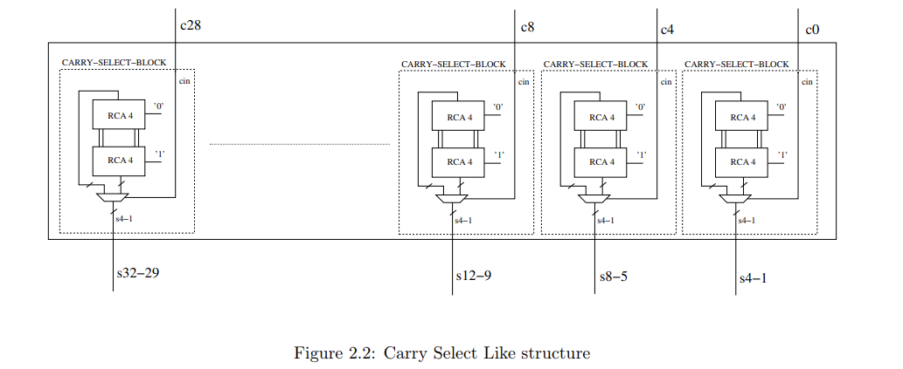
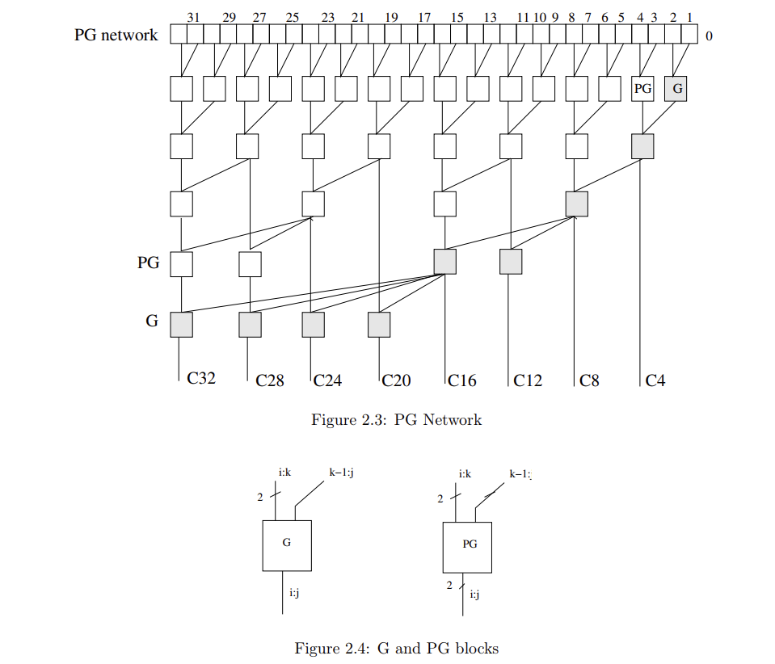
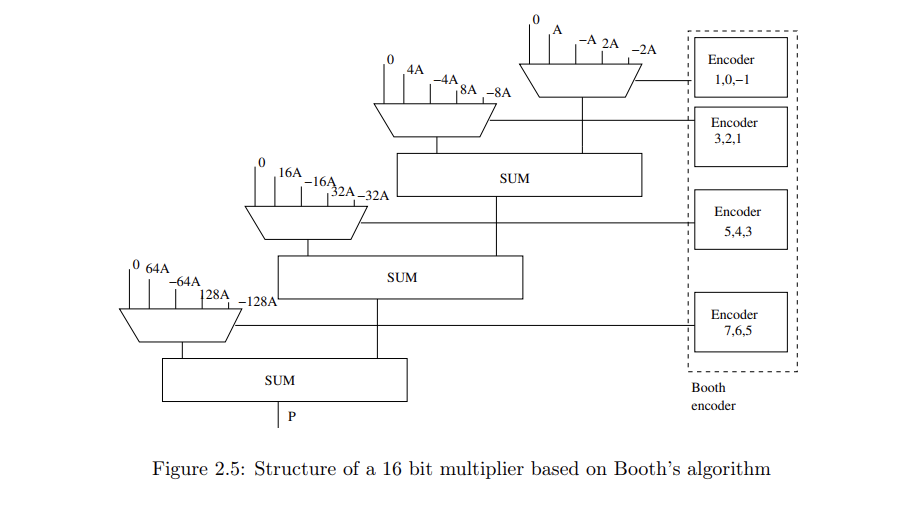
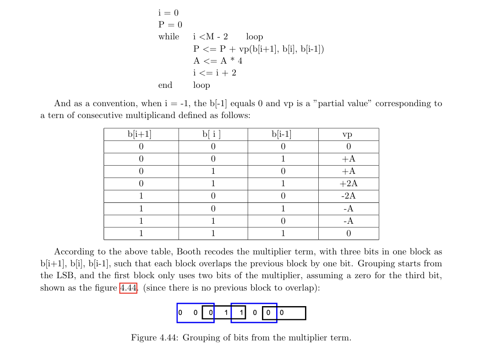
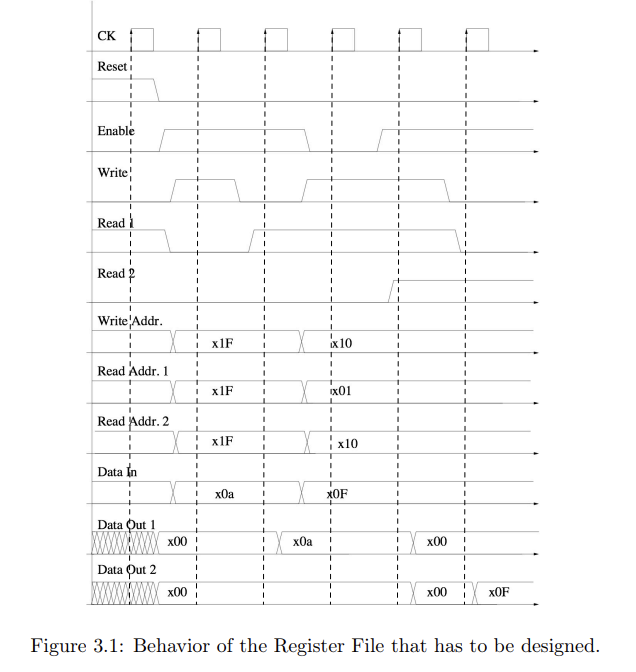
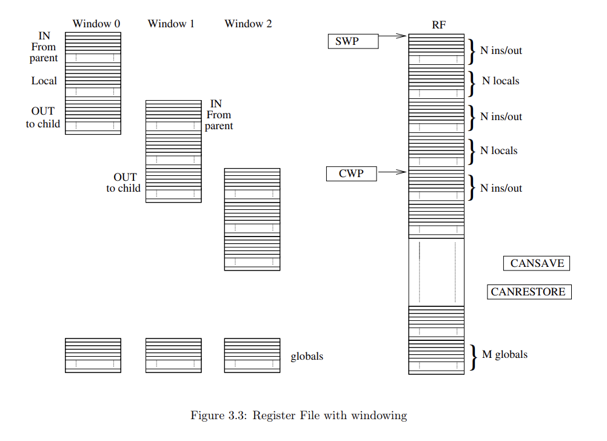

# Microelectronic Systems
Repository contenente tutti i file di tutti i laboratori di micro

## gr31_lab01 - Laboratorio 1
Contiene tutti i file per il laboratorio 1 di microelectronic systems.

## gr31_lab02 - Laboratorio 2
### Parte 1 - Pentium 4 adder/subtractor
La prima parte è stata costruire il sum generator secondo il grafico:

Poi lo sparse tree look-ahead carry generator

### Parte 2 - Booth's algorithm multiplier

L'algoritmo di Booth è un algoritmo per la moltiplicazione che da risultati in complemento di 2; per la realizzazione dell'encoder/selector è stata utilizzata la tabella:

## gr31_lab03 - Laboratorio 3
### Parte 1 - Register file
La prima parte consiste nel creare codice per il un register file normale sulla base del seguente diagramma dei segnali

### Parte 2 - windowed register file
Qui è richiesto di modificare il file di partenza in maniera tale che venga implementato il windowing, con seguente schema
